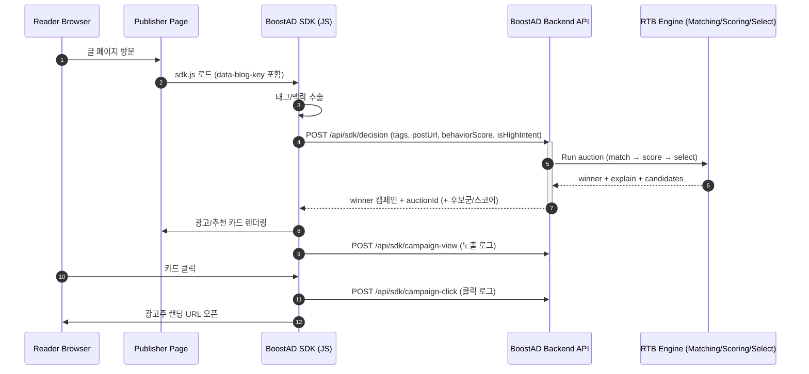

# web27-boostcamp

<svg width="800" height="250" viewBox="0 0 800 250" xmlns="http://www.w3.org/2000/svg" overflow="hidden">
  <defs>
    <linearGradient id="bgGradient" x1="0" y1="0" x2="1" y2="1">
      <stop offset="0%" stop-color="#f8fafc"/>
      <stop offset="100%" stop-color="#e2e8f0"/>
    </linearGradient>
    <filter id="glow" x="-50%" y="-50%" width="200%" height="200%">
      <feGaussianBlur stdDeviation="4" result="coloredBlur"/>
      <feMerge>
        <feMergeNode in="coloredBlur"/>
        <feMergeNode in="SourceGraphic"/>
      </feMerge>
    </filter>
    
    <symbol id="ad-chaos-1" viewBox="0 0 40 40">
        <path d="M20 0L25 15H40L28 25L33 40L20 30L7 40L12 25L0 15H15L20 0Z" fill="#ef4444" opacity="0.7"/> </symbol>
    <symbol id="ad-chaos-2" viewBox="0 0 40 40">
        <rect x="5" y="5" width="30" height="30" transform="rotate(15 20 20)" fill="#eab308" opacity="0.7"/> </symbol>
    <symbol id="ad-chaos-3" viewBox="0 0 40 40">
        <path d="M5 20L20 5L35 20L20 35Z" fill="#f97316" opacity="0.7"/> </symbol>

    <symbol id="info-node-1" viewBox="0 0 30 30">
        <circle cx="15" cy="15" r="12" fill="#3b82f6"/> <circle cx="15" cy="15" r="6" fill="#93c5fd"/>
    </symbol>
    <symbol id="info-node-2" viewBox="0 0 30 30">
        <rect x="2" y="2" width="26" height="26" rx="6" fill="#10b981"/> <path d="M8 15L13 20L22 10" stroke="white" stroke-width="3" fill="none"/>
    </symbol>
    <symbol id="info-node-3" viewBox="0 0 30 30">
        <circle cx="15" cy="15" r="14" fill="none" stroke="#8b5cf6" stroke-width="3"/> <path d="M15 5V25M5 15H25" stroke="#8b5cf6" stroke-width="3"/>
    </symbol>
  </defs>

  

  <rect width="100%" height="100%" class="bg-rect"/>

  <g transform="translate(400, 125)">
    <circle cx="0" cy="0" r="50" class="scan-ring" style="animation-delay: 0s;"/>
    <circle cx="0" cy="0" r="50" class="scan-ring" style="animation-delay: 1s; stroke: #10b981;"/>
  </g>

  <g class="chaos-group" transform="translate(400, 125)">
    <g transform="translate(-300, -80)"><use href="#ad-chaos-1" width="50" height="50" class="chaos-element" style="animation-delay: -0.5s;"/></g>
    <g transform="translate(-220, -20)"><use href="#ad-chaos-2" width="40" height="40" class="chaos-element" style="animation-delay: -1.2s;"/></g>
    <g transform="translate(-280, 60)"><use href="#ad-chaos-3" width="45" height="45" class="chaos-element" style="animation-delay: -2.1s;"/></g>
    <g transform="translate(-150, 90)"><use href="#ad-chaos-1" width="35" height="35" class="chaos-element" style="animation-delay: -0.2s;"/></g>
    <g transform="translate(250, -90)"><use href="#ad-chaos-2" width="40" height="40" class="chaos-element" style="animation-delay: -1.8s;"/></g>
    <g transform="translate(200, 70)"><use href="#ad-chaos-3" width="50" height="50" class="chaos-element" style="animation-delay: -0.9s;"/></g>
  </g>

  <g class="info-group" transform="translate(400, 125)">
    <line x1="-180" y1="-40" x2="-60" y2="0" class="connect-line"/>
    <line x1="-60" y1="0" x2="60" y2="0" class="connect-line"/>
    <line x1="60" y1="0" x2="180" y2="-40" class="connect-line"/>
    <line x1="-120" y1="70" x2="-60" y2="0" class="connect-line"/>
    <line x1="60" y1="0" x2="120" y2="70" class="connect-line"/>

    <g transform="translate(-180, -40)"><use href="#info-node-2" width="40" height="40" class="info-node" style="animation-delay: 4.1s;"/></g>
    <g transform="translate(-120, 70)"><use href="#info-node-3" width="36" height="36" class="info-node" style="animation-delay: 4.3s;"/></g>
    <g transform="translate(-60, 0)"><use href="#info-node-1" width="44" height="44" class="info-node" style="animation-delay: 4.0s;"/></g>
    <g transform="translate(60, 0)"><use href="#info-node-2" width="44" height="44" class="info-node" style="animation-delay: 4.2s;"/></g>
    <g transform="translate(120, 70)"><use href="#info-node-1" width="36" height="36" class="info-node" style="animation-delay: 4.4s;"/></g>
    <g transform="translate(180, -40)"><use href="#info-node-3" width="40" height="40" class="info-node" style="animation-delay: 4.1s;"/></g>
  </g>

  <text x="50%" y="46%" dominant-baseline="middle" text-anchor="middle" class="main-title">
    BoostAD
  </text>
  <text x="50%" y="66%" dominant-baseline="middle" text-anchor="middle" class="sub-slogan">
    광고가 정보가 되는 경험
  </text>
</svg>

> **"광고가 정보가 되는 경험"**  
> 개발자 기술 블로그의 **맥락(Context)** + **학습 의도(Intent)** 를 기반으로, 크리에이터가 **입찰(RTB)** 해 노출되는 투명한 광고·추천 플랫폼  
> **Google Ads/Meta 같은 메인 광고 플랫폼을 대체하기보다**, 메인 채널이 놓치기 쉬운 **고의도·콘텐츠 맥락 구간**을 위한 *추가 채널*을 지향합니다.
 
 

## 🧐 문제 인식 (Why)

1. **맥락 없는 광고 노출**
   - “React 글”을 읽는데 “자동차 보험” 같은 무관한 광고가 뜨는 경험
   - 사용자의 쿠키 데이터를 기반으로 하는 광고로 인해 내 프라이버시가 노출되고 있나? 하는 불안감
2. **광고주 접근성 장벽**
   - 대형 플랫폼은 세팅이 복잡하고(옵션/용어/구조), 결과가 불투명해서 소규모 광고주가 운영하기 어려움
3. **너무 넓은 타겟팅 → 예산 낭비**
   - 노출(PV) 중심 최적화로 “진짜로 배우는 사람”을 선별하기 어려움

 
 

## ✅ 우리가 제안하는 해결 (What)

저희 프로젝트는 아래 3가지를 한 번에 만족하는 것을 목표로 합니다.

1. **콘텐츠 맥락 기반 매칭**
   - 과거 행동(쿠키)보다 **현재 읽는 글의 주제/태그**를 우선으로 독자의 읽는 경험을 해치지 않으면서 알맞은 광고를 매칭합니다.
2. **학습 행동(고의도) 기반 노출**
   - 예: **스크롤 깊이, 체류 시간, 코드 블록 복사** 등 “진짜 학습 중인 순간”을 신호로 활용
3. **입찰 로그의 투명성**
   - “왜 노출이 안 되었는지 / 얼마 차이로 졌는지”를 광고주가 이해할 수 있도록 로그를 보여줍니다.
   - 광고주 대시보드에서 제공되는 정보를 바탕으로 광고주 자신이 수익을 최대화할 수 있는 전략을 짤 수 있습니다.

 
 

## 🧑‍💻 포지셔닝 

저희 서비스는 Google Ads/Meta 같은 **메인 광고 플랫폼과 직접 경쟁(대체)** 하기보다, 메인 채널이 놓치기 쉬운 **고의도·콘텐츠 맥락 구간**을 위한 *추가 채널*을 지향합니다.

- Google Ads 같은 메인 채널: 대규모 도달/브로드 타겟팅 중심
- BoostAD: “지금 이 글을 진짜로 학습 중인 순간”에만 집중하는 마이크로 지면/경매
- 예산 운용: 메인 채널에 예산의 대부분을 집행하고(예: 80–90%), BoostAD에는 일부(예: 10–20%)를 배분해 **추가 전환/유입(초과 효율)**을 검증하는 보완 채널

예시)

- “NestJS 입문” 글을 **80% 이상 읽고 코드 블록을 복사**한 독자에게 → NestJS 강의 캠페인을 입찰로 노출

 
 

## 👥 주요 사용자

- **Publisher (퍼블리셔)**: 개발자 블로그/뉴스레터 운영자
- **Advertiser (광고주)**: 개발 강의 제작자, 개발 유튜버, 교육 서비스 운영자
- **Reader (독자)**: 기술 글을 읽고 따라 해보거나 더 깊이 공부해보고 싶은 개발자/학습자

 
 

## 🛠️ 핵심 기능

### 1) 퍼블리셔 경험

- 블로그에 SDK 스크립트 삽입으로 빠른 연동
- 글 맥락/태그 기반으로 관련 광고 카드 노출
- 대시보드에서 **노출/클릭/수익** 지표 확인

### 2) 광고주 경험

- 캠페인 등록 최소화(링크/태그/예산/입찰가 중심)
- 단순 노출 수치를 넘어, **학습 의지가 높은 유저**에게 닿는 효율적인 광고 채널
- Google Ads/Meta와 **직접 경쟁(대체)** 하기보다, 메인 채널이 커버하기 어려운 **고의도·맥락 슬롯**에 집중하는 보완 채널
- 대시보드에서 **성과 지표 + 입찰 로그** 확인 및 튜닝

### 3) 독자 경험

- “광고”가 아니라 “다음 단계 학습 추천 카드”처럼 자연스럽게 노출
- 프라이버시 부담이 큰 쿠키 추적 중심이 아닌, **현재 페이지 맥락/행동 신호** 중심

 
 

## 동작 흐름 (How)

---
## ERD

 
 

___
## 아키텍처 (초안)

 
 

---
## CI/CD 파이프라인
https://github.com/boostcampwm2025/web27-BoostAD/wiki/CICD-%ED%8C%8C%EC%9D%B4%ED%94%84%EB%9D%BC%EC%9D%B8

 
 

## 기술 스택

| 구분 | 기술 |
| --- | --- |
| Frontend |       |
| Backend |    |
| SDK |     |
| Infra/Deploy |     |
| Matching (실험) |    |

 
 

