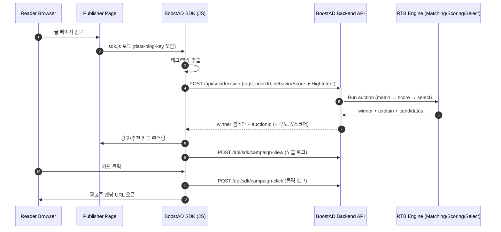

# web27-boostcamp

> **"광고가 정보가 되는 경험"**  
> 개발자 기술 블로그의 **맥락(Context)** + **학습 의도(Intent)** 를 기반으로, 크리에이터가 **입찰(RTB)** 해 노출되는 투명한 광고·추천 플랫폼  
> **Google Ads/Meta 같은 메인 광고 플랫폼을 대체하기보다**, 메인 채널이 놓치기 쉬운 **고의도·콘텐츠 맥락 구간**을 위한 *추가 채널*을 지향합니다.

## 🧐 문제 인식 (Why)

1. **맥락 없는 광고 노출**
   - “React 글”을 읽는데 “자동차 보험” 같은 무관한 광고가 뜨는 경험
   - 사용자의 쿠키 데이터를 기반으로 하는 광고로 인해 내 프라이버시가 노출되고 있나? 하는 불안감
2. **광고주 접근성 장벽**
   - 대형 플랫폼은 세팅이 복잡하고(옵션/용어/구조), 결과가 불투명해서 소규모 광고주가 운영하기 어려움
3. **너무 넓은 타겟팅 → 예산 낭비**
   - 노출(PV) 중심 최적화로 “진짜로 배우는 사람”을 선별하기 어려움

## ✅ 우리가 제안하는 해결 (What)

저희 프로젝트는 아래 3가지를 한 번에 만족하는 것을 목표로 합니다.

1. **콘텐츠 맥락 기반 매칭**
   - 과거 행동(쿠키)보다 **현재 읽는 글의 주제/태그**를 우선으로 독자의 읽는 경험을 해치지 않으면서 알맞은 광고를 매칭합니다.
2. **학습 행동(고의도) 기반 노출**
   - 예: **스크롤 깊이, 체류 시간, 코드 블록 복사** 등 “진짜 학습 중인 순간”을 신호로 활용
3. **입찰 로그의 투명성**
   - “왜 노출이 안 되었는지 / 얼마 차이로 졌는지”를 광고주가 이해할 수 있도록 로그를 보여줍니다.
   - 광고주 대시보드에서 제공되는 정보를 바탕으로 광고주 자신이 수익을 최대화할 수 있는 전략을 짤 수 있습니다.

## 🧑‍💻 포지셔닝 

저희 서비스는 Google Ads/Meta 같은 **메인 광고 플랫폼과 직접 경쟁(대체)** 하기보다, 메인 채널이 놓치기 쉬운 **고의도·콘텐츠 맥락 구간**을 위한 *추가 채널*을 지향합니다.

- Google Ads 같은 메인 채널: 대규모 도달/브로드 타겟팅 중심
- BoostAD: “지금 이 글을 진짜로 학습 중인 순간”에만 집중하는 마이크로 지면/경매
- 예산 운용: 메인 채널에 예산의 대부분을 집행하고(예: 80–90%), BoostAD에는 일부(예: 10–20%)를 배분해 **추가 전환/유입(초과 효율)**을 검증하는 보완 채널

예시)

- “NestJS 입문” 글을 **80% 이상 읽고 코드 블록을 복사**한 독자에게 → NestJS 강의 캠페인을 입찰로 노출

## 👥 주요 사용자

- **Publisher (퍼블리셔)**: 개발자 블로그/뉴스레터 운영자
- **Advertiser (광고주)**: 개발 강의 제작자, 개발 유튜버, 교육 서비스 운영자
- **Reader (독자)**: 기술 글을 읽고 따라 해보거나 더 깊이 공부해보고 싶은 개발자/학습자

## 🛠️ 핵심 기능

### 1) 퍼블리셔 경험

- 블로그에 SDK 스크립트 삽입으로 빠른 연동
- 글 맥락/태그 기반으로 관련 광고 카드 노출
- 대시보드에서 **노출/클릭/수익** 지표 확인

### 2) 광고주 경험

- 캠페인 등록 최소화(링크/태그/예산/입찰가 중심)
- 단순 노출 수치를 넘어, **학습 의지가 높은 유저**에게 닿는 효율적인 광고 채널
- Google Ads/Meta와 **직접 경쟁(대체)** 하기보다, 메인 채널이 커버하기 어려운 **고의도·맥락 슬롯**에 집중하는 보완 채널
- 대시보드에서 **성과 지표 + 입찰 로그** 확인 및 튜닝

### 3) 독자 경험

- “광고”가 아니라 “다음 단계 학습 추천 카드”처럼 자연스럽게 노출
- 프라이버시 부담이 큰 쿠키 추적 중심이 아닌, **현재 페이지 맥락/행동 신호** 중심

## 동작 흐름 (How)

---
## ERD

___
## 아키텍처

---

## 기술 스택

| 구분 | 기술 |
| --- | --- |
| Frontend |       |
| Backend |    |
| SDK |     |
| Infra/Deploy |     |
| Matching (실험) |    |

## CI/CD (GitHub Actions / NCP)
### 목차

- CI (PR 검증): `web27-boostcamp/.github/workflows/pr-ci.yml`
- CD (Frontend 배포): `web27-boostcamp/.github/workflows/front-deploy.yml`
- CD (SDK 배포): `web27-boostcamp/.github/workflows/sdk-deploy.yml`
- CD (Backend/Nginx 배포): `web27-boostcamp/.github/workflows/back-deploy.yml`
- Secrets / Variables 가이드

---

### CI (Pull Request 검증) — `pr-ci.yml`

- 트리거: `pull_request` (base 브랜치 제한 없이 PR이면 실행)
- 목적: PR 단계에서 **빌드/린트/테스트** 및 **Docker 빌드 가능 여부**를 검증
- 구성(병렬 Job)
  - `backend`: lint/test/build 검증
  - `frontend`: lint/build 검증
  - `docker-build`: `docker-compose.yml` 기준 이미지 빌드 검증

---

### CD (배포) 공통 — Branch gating

- 기본 배포 브랜치: `feature/deploy`
- GitHub Actions Variable `DEPLOY_BRANCH`를 설정하면, **해당 브랜치에서만** 배포 워크플로우가 동작합니다. (미설정 시 `feature/deploy`)
- 배포 워크플로우는 `workflow_dispatch`(수동 실행)도 지원합니다.

---

### CD (Frontend 배포 / Object Storage) — `front-deploy.yml`

- 트리거: `frontend/**` 변경 시 push 또는 수동 실행
- 동작 조건: push는 `DEPLOY_BRANCH`일 때만 배포
- 산출물: Frontend 빌드 결과물(정적 파일)
- 배포 방식: NCP Object Storage 버킷으로 업로드(동기화)
- 빌드에 사용되는 Variables
  - `VITE_API_URL`: 프론트가 호출할 API 베이스 URL
  - `VITE_SDK_URL`: 프론트에서 참조할 SDK URL(사용 시)

---

### CD (SDK 배포 / Object Storage) — `sdk-deploy.yml`

- 트리거: `sdk/**` 변경 시 push 또는 수동 실행
- 동작 조건: push는 `DEPLOY_BRANCH`일 때만 배포
- 산출물: SDK 빌드 결과물(배포용 `dist`)
- 배포 방식: NCP Object Storage 버킷의 `sdk/` prefix로 업로드(동기화)
- 빌드에 사용되는 Variables
  - `VITE_API_URL`: SDK가 호출할 API 베이스 URL

---

### CD (Backend/Nginx 배포 / NCR + SSH) — `back-deploy.yml`

- 트리거: `backend/**`, `nginx/**`, `docker-compose.yml` 변경 시 push 또는 수동 실행
- 동작 조건: push는 `DEPLOY_BRANCH`일 때만 배포
- 1) Build & Push
  - Backend/Nginx Docker 이미지를 빌드해 NCP Container Registry(NCR)에 푸시
  - 태그는 커밋 SHA 기반으로 관리
- 2) Deploy
  - GitHub Actions에서 서버로 SSH 접속
  - 서버에서 `DEPLOY_BRANCH` 기준으로 코드를 동기화한 뒤, Docker Compose로 컨테이너를 갱신
  - 배포 시점의 커밋 SHA를 `IMAGE_TAG`로 주입해, 해당 버전의 이미지를 pull 하도록 구성
