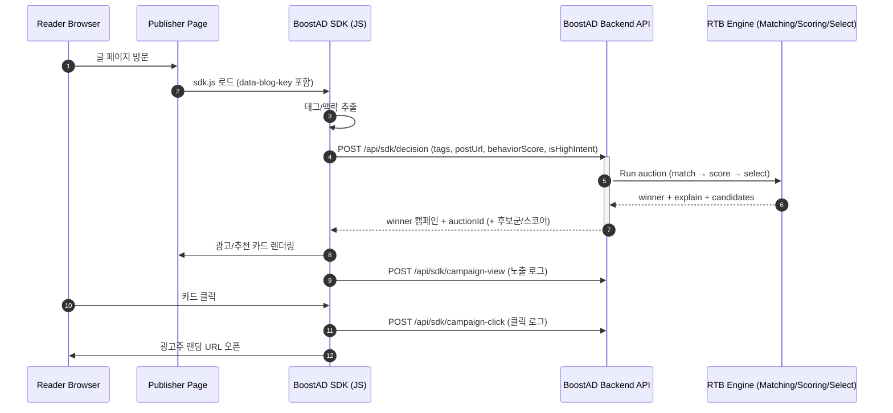

# BoostAD 🎯

<!-- 배너 이미지 -->
<div align="center">
  
  
  
  <h3>광고가 정보가 되는 경험</h3>
  <p>개발자 블로그를 위한 맥락 기반 광고 플랫폼</p>
  
  <br/>
  
  <a href="https://www.boostad.site/">🚀 서비스 바로가기</a> |
  <a href="https://github.com/boostcampwm2025/web27-BoostAD/wiki">📚 기술 Wiki</a> |
  <a href="https://www.figma.com/board/3TM2J3qTIlyXl6zpnAmXBV/%EA%B7%B8%EB%A3%B9%ED%94%84%EB%A1%9C%EC%A0%9D%ED%8A%B8-1%EC%A3%BC%EC%B0%A8?node-id=0-1&p=f&t=qnvBRZG8oNuI4kgO-0">📋 팀 피그잼</a>
  
</div>

---

## 💡 이런 경험 있으신가요?

> "React 글 읽는데 자동차 보험 광고가 뜬다..."

- 📖 기술 블로그를 읽는데 **전혀 관련 없는 광고**가 노출되는 경험
- 🍪 내 쿠키 데이터가 추적당하는 것 같은 **불안함**
- 💸 광고주로서 **어디에 노출됐는지 알 수 없는** 답답함

---

## ✨ BoostAD가 제안하는 해결책

<div align="center">
  <table>
    <tr>
      <td align="center">🎯</td>
      <td align="center">📊</td>
      <td align="center">🔍</td>
    </tr>
    <tr>
      <td align="center"><b>맥락 기반 매칭</b></td>
      <td align="center"><b>학습 행동 감지</b></td>
      <td align="center"><b>투명한 입찰</b></td>
    </tr>
    <tr>
      <td>쿠키가 아닌<br/>현재 읽는 글의 주제로</td>
      <td>스크롤 깊이, 체류 시간<br/>진짜 학습 중인 순간 포착</td>
      <td>왜 노출됐는지/안됐는지<br/>광고주가 직접 확인</td>
    </tr>
  </table>
</div>

---

## 🎬 주요 기능

<table>
  <tr>
    <td align="center" width="50%">
      <h4>📝 SDK 연동</h4>
      
      <p>스크립트 한 줄로 블로그에 광고 슬롯 추가</p>
    </td>
    <td align="center" width="50%">
      <h4>🎯 맥락 기반 광고 노출</h4>
      
      <p>글의 태그·주제에 맞는 광고가 자연스럽게 노출</p>
    </td>
  </tr>

  <tr>
    <td align="center">
      <h4>📊 캠페인 생성</h4>
      
      <p>복잡한 세팅 없이 빠르게 캠페인 등록</p>
    </td>
    <td align="center">
      <h4>💰 예산 & 입찰가 관리</h4>
      
      <p>일 예산과 CPC 입찰가를 직접 설정</p>
    </td>
  </tr>

  <tr>
    <td align="center">
      <h4>📈 성과 대시보드</h4>
      
      <p>노출, 클릭, CTR 등 실시간 성과 확인</p>
    </td>
    <td align="center">
      <h4>🔍 입찰 로그 (투명성)</h4>
      
      <p>왜 노출됐는지 / 안 됐는지 경매 결과 공개</p>
    </td>
  </tr>
</table>

---


## 🔄 어떻게 동작하나요?

<div align="center">
  


</div>

```
1️⃣ 독자가 기술 블로그 방문
2️⃣ SDK가 글의 태그/맥락 분석
3️⃣ RTB 엔진이 최적의 광고 선정
4️⃣ 맥락에 맞는 광고 카드 노출
```

> 💡 더 자세한 기술 구현이 궁금하다면? [Wiki 바로가기](https://github.com/boostcampwm2025/web27-BoostAD/wiki)

---

## 🛠 기술 스택

<div align="center">

|     Frontend      |    Backend    |     Infra      |
| :---------------: | :-----------: | :------------: |
| React, TypeScript | NestJS, MySQL | Docker, Nginx  |
|  Vite, Tailwind   |    TypeORM    | GitHub Actions |
|      Zustand      |               |      NCP       |

</div>

> 📚 아키텍처, ERD, CI/CD 등 상세 내용은 [Wiki 최종 아키텍처](https://github.com/boostcampwm2025/web27-BoostAD/wiki)에서 확인하세요!

---

## 👥 팀원 소개

<div align="center">
  <table>
    <tr>
      <td align="center">
        <a href="https://github.com/kitae9999">
          <br/>
          <b>Ash</b><br/>
          박기태
        </a>
      </td>
      <td align="center">
        <a href="https://github.com/2seb2">
          <br/>
          <b>Jerry</b><br/>
          이세비
        </a>
      </td>
      <td align="center">
        <a href="https://github.com/tomass22">
          <br/>
          <b>Tomas</b><br/>
          이정훈
        </a>
      </td>
      <td align="center">
        <a href="https://github.com/chazicer">
          <br/>
          <b>Huni</b><br/>
          차태훈
        </a>
      </td>
    </tr>
  </table>
</div>

---

## 🤝 협업 중인 프로젝트

BoostAD SDK를 사용 중인 부스트캠프 10기 동료들의 프로젝트도 확인해보세요!

- [WEB01 BoostUS](https://boostus.site)
- [WEB04 우리 모두 다빈치](https://we-are-all-davinci.netlify.app/)
- [WEB08 JAMstack](https://lets-codejam.vercel.app/)
- [WEB11 말만해](https://malmanhae.com/)
